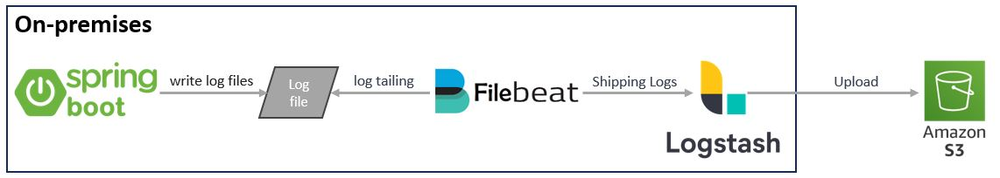

# spring-boot-logstash-aop
## Introduction
Expanding on the earlier article's exploration of centralized logging with AOP, the focus now turns to a thorough examination of log management strategies. 

Moving beyond the basic act of coding to record logs in files, the emphasis is on envisioning how logs can actively contribute to investigating problems and, ideally, be utilized for predictive analysis to anticipate issues in the future.\
One of the most recognized tech stacks for log management is the ELK Stack (Elasticsearch, Logstash, and Kibana). Renowned for its potency, the ELK Stack excels in preserving, filtering, transforming, and searching logs in near real-time.\
However, this article will not utilize the entire ELK stack. Instead, specific components like Logstash will be employed and integrated with other tools. To facilitate understanding, refer to the illustration below, where I will delve into detailed explanations.

In the illustration, you're going to see that I try to setup "hybrid logging solution". This reflects the combination of on-premise components (Spring Boot, Filebeat) and cloud-based storage (S3) for managing and storing logs. 
