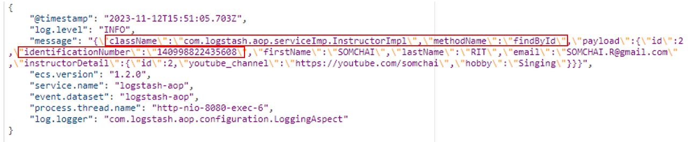

# spring-boot-logstash-aop
## Introduction
Expanding on the earlier article's exploration of centralized logging with AOP, the focus now turns to a thorough examination of log management strategies. 

Moving beyond the basic act of coding to record logs in files, the emphasis is on envisioning how logs can actively contribute to investigating problems and, ideally, be utilized for predictive analysis to anticipate issues in the future.\
One of the most recognized tech stacks for log management is the ELK Stack (Elasticsearch, Logstash, and Kibana). Renowned for its potency, the ELK Stack excels in preserving, filtering, transforming, and searching logs in near real-time.\
However, this article will not utilize the entire ELK stack. Instead, specific components like Logstash will be employed and integrated with other tools. To facilitate understanding, refer to the illustration below, where I will delve into detailed explanations.


In the illustration, you're going to see that I try to setup "hybrid logging solution". This reflects the combination of on-premise components (Spring Boot, Filebeat, Logstash) and cloud-based storage (S3) for storing logs.\
Please take a look at the details for each one below.

`Spring Boot` is responsible for producing log messages related to your application's behavior. These logs could include information about transactions, errors, and other relevant events.

`Filebeat` is employed to read logs generated by Spring Boot. It efficiently harvests log data and sends it to Logstash for further processing. Filebeat also facilitates the filtering of log entries before reaching Logstash.

`Logstash` acts as an intermediary between Filebeat and S3. It processes incoming log entries, applies filters, and prepares the data for storage in S3. It can also enrich logs with additional information, if needed.

`S3` serves as the ultimate destination for log storage. Logstash uploads processed log files to S3, where they can be archived, analyzed, or accessed as needed. 

## Scenario
I would like to briefly describe the scenario that we will implement before we drill down into the configuration part.
According to the illustration below, it's an example of a log format that Spring Boot is going to write into a log file. And you might notice that the log has a pretty good format; this is because I implemented it using Elastic Common Schema (ECS).\
`The actual log from our application is going to be kept inside the "message"`

Certainly! In our scenario, we need to achieve the following:

1.`Drop Fields`: Eliminate the className and methodName fields from the logs before they are sent to S3. We'll utilize `Filebeat` to handle this task.

2.`Mark Identification Number`: Apply the identification number "xxxxxxxxxxx" to the logs. This marking operation will be performed by `Logstash`.

By adopting this approach, we showcase the capabilities of both Filebeat and Logstash in our log processing pipeline. Filebeat takes care of dropping specific fields, while Logstash handles the marking process.

## Spring Boot configuration
The origin of the log files mentioned earlier is Spring Boot. To create log files, it's essential to set up and configure a log framework like logback within Spring Boot. Assuming this configuration is in place, the next step involves adapting the log file format to conform with the Elastic Common Schema (ECS). To achieve this, importing the co.elastic.logging dependency is necessary, and a few adjustments in the logback file are required. For detailed instructions, you can refer to the article.\
For additional information, please look at [ECS Logging Java](https://www.elastic.co/guide/en/ecs-logging/java/current/setup.html)

## Filebeat configuration
Configuration with Filebeat is an essential thing to do because Filebeat's going to monitor our log file and push new logs to the destination. However, aside from configuring the tallying log, we also need to configure Filbeat to drop some files as well.\
I will provide an example of Filebeat below.

 ```
filebeat.inputs:
- type: log
  paths:
    - /path/to/file/logs/example.log
  json.keys_under_root: true
  json.overwrite_keys: false

output.logstash:
  hosts: ["localhost:5044"]
 ```
For the detailed configuration, please look at [filebeat-input-log-config-json](https://www.elastic.co/guide/en/beats/filebeat/current/filebeat-input-log.html#filebeat-input-log-config-json)

```diff
- Note: Filebeat processes the logs line by line, so the JSON decoding only works if there is one JSON object.
```
According to the message above, if your log is split into multiple lines or if your log has a combination of strings and JSON, In this scenario, the configuration will be like this.
 ```
filebeat.inputs:
- type: log
  paths:
    - /path/to/file/logs/example.log
  multiline.pattern: '^\{'  # Pattern to match the start of a JSON object
  multiline.negate: true
  multiline.match: after

output.logstash:
  hosts: ["localhost:5044"]
 ```
For the detailed configuration, please look at [Manage multiline messages](https://www.elastic.co/guide/en/beats/filebeat/current/multiline-examples.html#multiline-examples)

Until now, we've set up the source logs that Filebeat will monitor and the destination where Filebeat will send our logs. The next step is to configure Filebeat to drop specific fields. In this instance, we want to remove the className and methodName fields.\
Please refer to the previous illustration for context.

In order to drop fields, Filebeat actually has a feature to remove specific field names very easily, like this:
```
processors:
  - drop_fields:
      fields: ["className", "methodName"]
```
For the detailed configuration, please look at [Drop fields from events](https://www.elastic.co/guide/en/beats/filebeat/current/drop-fields.html#drop-fields)

I attempted to configure it as shown in the example above, but unfortunately, it did not produce the desired results. During my research for an alternative solution, I discovered that Filebeat supports the execution of JavaScript code.  
For more information [Script Processor](https://www.elastic.co/guide/en/beats/filebeat/current/processor-script.html#processor-script)

Therefore, I decided to use this solution, and the configuration will be like this:
```
processors:
- script:
    lang: javascript
    id: my_script
    source: >
      function process(event) {
        var message = event.Get("message");
        var messageData = JSON.parse(message);
        delete messageData.className;
        delete messageData.methodName;
        event.Put("message", JSON.stringify(messageData));
      }
```
## Logstash configuration
On the Logstash configuration, there are 2 parts that we need to configure to follow the workflow and requirement at below
1.Marking Identification Number.
2.Upload log file after process to AWS S3 bucket.
